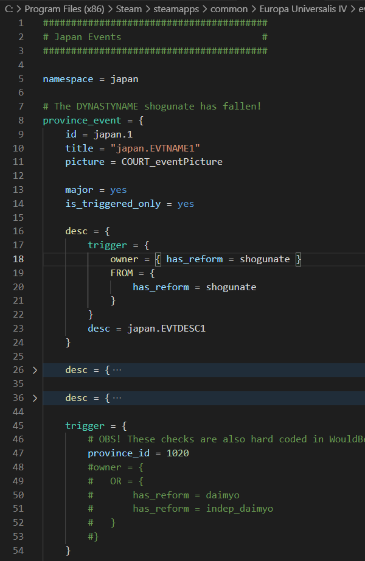

# EU4 Code Syntax Highlighting

## Features

Rich syntax highlighting and code folding that is based on Regex and known, hardcoded (as of 1.31.3) high-level scopes.

Works with any EU4 .txt file coding system.

## Requirements

[PowerShell Core](https://github.com/PowerShell/PowerShell/releases/latest) (pwsh) must be installed in order to utilize the automated workspace tasks.

## Extension Settings

No configurable settings at this time.

## Known Issues

No known issues - please log any found bugs/issues/suggestion in the Issues board.

## Release Notes

### __v0.1.0__

First beta release.
